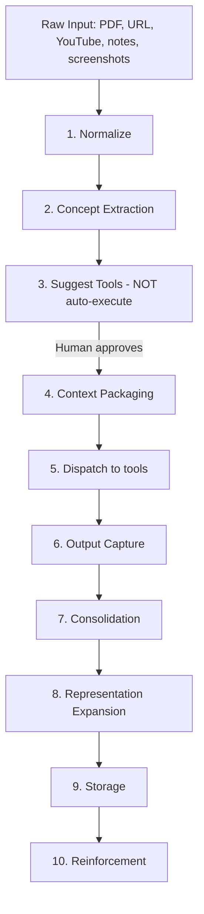

# Personal Learning OS

> A learning orchestration engine that routes knowledge through the best tools, captures outputs, and builds a compounding understanding graph.

**This is NOT** a note-taking app or a summarizer.
**This IS** a system of skills, agents, and tools that helps you learn effectively — optimized for audio-visual cues and personal notes/diagrams.

---

## Table of Contents

- [Core Philosophy](#core-philosophy)
- [Tool Catalog](#tool-catalog)
- [Agent Architecture](#agent-architecture)
- [Processing Pipeline](#processing-pipeline)
- [Auto-Organization System](#auto-organization-system)
- [Recommended MVP Stack](#recommended-mvp-stack)

---

## Core Philosophy

1. **Human-in-the-loop tool selection** — suggest tools, never auto-execute
2. **Minimal friction dispatch** — deep links, clipboard injection, browser automation
3. **Never lose outputs** — every tool result is captured and stored
4. **Multi-representation learning** — every concept gets a summary, diagram, audio, code snippet, and analogy
5. **Continuous organization** — every new input triggers re-cluster, re-link, and surfaces connections
6. **Do NOT rebuild tools** — build context preparation + dispatch + consolidation + reinforcement

---

## Tool Catalog

### 1. Document & Research Understanding

| Tool | What It Does | Notes |
|------|-------------|-------|
| **NotebookLM** (Google) | Multi-doc reasoning, podcast-style audio summaries | Core tool — covers both research and audio learning |
| **Elicit** | Academic research, literature review | Best for systematic paper discovery |
| **SciSpace Copilot** | Paper understanding, equations, figures | Explains math/figures inline |
| **Consensus** | Scientific answer engine, claim validation | Cross-references multiple papers |

### 2. Knowledge Management & Organization

| Tool | What It Does | Notes |
|------|-------------|-------|
| **Notion + Notion AI** | Databases, dashboards, structured notes | Primary structured storage |
| **Obsidian** | Graph-based notes, backlinks, local-first | Primary graph/relational storage |
| **Mem AI** | Auto-organizing, clustering, resurfacing | AI-native knowledge base |
| **Saner.AI** | AI-powered research organization | NotebookLM alternative with better organization workflows |
| **AFFiNE** | Open-source KnowledgeOS (notes + drawing + planning) | Edgeless canvas — great for visual learners who sketch |
| **Tana** | Supertags, queries, automation | Build custom research systems with structured data |
| **Elephas** | Privacy-first, offline-capable AI assistant | Multi-AI provider, works without internet |

### 3. General AI Reasoning & Synthesis

| Tool | What It Does | Notes |
|------|-------------|-------|
| **Claude** (Anthropic) | Deep reasoning, long context, synthesis | Primary reasoning engine |
| **ChatGPT** (OpenAI) | Code execution, multimodal, custom GPT workflows | Complementary — strong at code + vision |

### 4. Search & Discovery

| Tool | What It Does | Notes |
|------|-------------|-------|
| **Perplexity** | Real-time web search with citations | Primary search tool |
| **YouTube + Eightify** | Visual explanations, video summarization | Key for audio-visual learning style |

### 5. Spaced Repetition & Flashcards

| Tool | What It Does | Notes |
|------|-------------|-------|
| **Anki + FSRS** | Flashcards with ML-based scheduling | FSRS algorithm is 20-30% more efficient than SM-2 |
| **RemNote** | Combined notes + flashcards + PDF annotation | Uses FSRS; great if you want notes and cards in one place |
| **LectureScribe** | Auto-generates flashcards from lectures | Feed in lecture recordings → get study cards |

### 6. Visual & Diagramming

| Tool | What It Does | Notes |
|------|-------------|-------|
| **Mermaid** (built-in) | Pipeline generates diagrams as code | Embedded in markdown, version-controllable |
| **Mapify** | Upload photos/charts/notes → AI mind maps | Turns handwritten notes into structured maps |
| **Atlas** | Connected concept maps across sources | Links concepts across multiple documents |
| **XMind Copilot** | Drop in webpage/doc/PDF/video → structured mind map | One-click conversion from any source |
| **GitMind** | Auto-organizes key points from handouts | Good for processing lecture handouts |
| **Excalidraw MCP** | Prompt-to-diagram generation inline in chat | Integrates with Claude Code / MCP workflows |
| **DiagrammingAI** | Mermaid → Excalidraw visual editor | Bridge between code diagrams and freeform sketching |
| **Think Machine** | 3D AI-powered mind mapping | Spatial/3D visualization of concept relationships |

### 7. Audio & TTS (Passive Learning)

| Tool | What It Does | Notes |
|------|-------------|-------|
| **NotebookLM** (podcast mode) | Generates conversational audio from documents | Primary audio learning tool |
| **ElevenLabs** | High-quality text-to-speech | Best commercial voice quality |
| **Speechify** | Text-to-audio for students/readers | Optimized for long-form reading |
| **Descript** | Edit audio by editing text | Great for creating/editing learning podcasts |
| **Fish Audio** | Affordable ElevenLabs alternative | Lower cost for high-volume TTS |
| **Coqui XTTS / Bark / StyleTTS2** | Open-source TTS | Self-hostable, rivals commercial quality |
| **Otter.ai** | Transcription | Capture lecture/meeting audio as text |

### 8. Code & Execution

| Tool | What It Does | Notes |
|------|-------------|-------|
| **Jupyter Notebooks** | Interactive code + markdown | Local execution |
| **Google Colab** | Cloud notebooks with GPU | Free GPU for ML experiments |

---

## Agent Architecture

Five specialized agents, each with a single responsibility:

```
┌─────────────────────────────────────────────────────────┐
│                   PERSONAL LEARNING OS                  │
│                                                         │
│  ┌──────────────┐  ┌──────────────┐  ┌──────────────┐  │
│  │  Ingestion   │→ │   Concept    │→ │    Tool      │  │
│  │    Agent     │  │    Agent     │  │  Suggestion  │  │
│  │              │  │              │  │    Agent     │  │
│  │ Parse PDFs,  │  │ Extract      │  │ Recommend    │  │
│  │ links, text  │  │ structured   │  │ best tools   │  │
│  │              │  │ concepts     │  │ per concept  │  │
│  └──────────────┘  └──────────────┘  └──────┬───────┘  │
│                                             │          │
│                                      ┌──────▼───────┐  │
│  ┌──────────────┐                    │  Organizer   │  │
│  │Reinforcement │◄───────────────────│    Agent     │  │
│  │    Agent     │                    │              │  │
│  │              │                    │ Update graph,│  │
│  │ Flashcards,  │                    │ cluster      │  │
│  │ revisit      │                    │ topics       │  │
│  │ schedule     │                    └──────────────┘  │
│  └──────────────┘                                      │
└─────────────────────────────────────────────────────────┘
```

| Agent | Responsibility |
|-------|---------------|
| **Ingestion Agent** | Parse PDFs, URLs, YouTube links, text notes, screenshots → normalized text |
| **Concept Agent** | Generate structured summaries, extract concept lists |
| **Tool Suggestion Agent** | Rank and recommend best tools per concept (human approves) |
| **Organizer Agent** | Update concept graph, cluster topics, surface connections |
| **Reinforcement Agent** | Generate flashcards, schedule revisits, create application tasks |

---

## Processing Pipeline



### Step Details

| Step | What Happens | Example |
|------|-------------|---------|
| **1. Normalize** | Extract text, sections, images, code from raw inputs | PDF → structured sections |
| **2. Concept Extraction** | LLM extracts structured concept lists | `concepts: [KV cache, attention scaling, memory bandwidth]` |
| **3. Suggest Tools** | Return ranked tool suggestions per concept | "For 'KV cache': 1. NotebookLM (audio overview) 2. Claude (deep dive) 3. SciSpace (math)" |
| **4. Context Packaging** | Prepare tool-specific inputs | Full doc → NotebookLM; key sections → Claude; equation+context → SciSpace; short query → Perplexity |
| **5. Dispatch** | Send to tools via deep links, clipboard, or browser automation | Open NotebookLM with document pre-loaded |
| **6. Output Capture** | Store structured output | `{concept: "KV cache", type: "summary", content: "...", tool: "Claude"}` |
| **7. Consolidation** | Merge outputs from paper + blog + video | Unified explanation noting differences and unique insights per source |
| **8. Representation Expansion** | Generate multiple formats | Summary, Mermaid diagram, code snippet, analogy, audio |
| **9. Storage** | Push to knowledge stores | Notion (structured DB) + Obsidian (graph with backlinks) |
| **10. Reinforcement** | Create review materials | Flashcards (Anki/RemNote), revisit schedule, application tasks |

---

## Auto-Organization System

Three layers that keep your knowledge graph alive:

### Concept Graph

Every concept tracks its relationships:

```yaml
KV_cache:
  depends_on: [attention]
  affects: [latency, memory_usage]
  related_to: [batching, quantization]
  learned_from: [paper_xyz, video_abc]
  representations: [summary, diagram, audio, code]
```

### Dynamic Clustering

Auto-group related concepts as they accumulate:

```
LLM Systems:
  ├── Attention Mechanisms
  │   ├── KV cache
  │   ├── multi-head attention
  │   └── attention scaling
  ├── Optimization
  │   ├── quantization
  │   ├── batching
  │   └── memory bandwidth
  └── Training
      ├── loss functions
      └── gradient checkpointing
```

### Continuous Update

Every new input triggers:
1. **Re-cluster** — does this concept belong to an existing group or create a new one?
2. **Re-link** — what existing concepts does this connect to?
3. **Surface connections** — "You learned about KV cache last week; this new paper on paged attention extends that idea"

---

## Recommended MVP Stack

Start with four tools that cover the core learning loop, optimized for audio-visual learning:

```
┌─────────────────────────────────────────────────────┐
│                    MVP STACK                         │
│                                                     │
│  ┌─────────────┐    ┌─────────────┐                 │
│  │ NotebookLM  │    │   Claude    │                 │
│  │ Audio +     │    │ Reasoning + │                 │
│  │ Synthesis   │    │ Synthesis   │                 │
│  └──────┬──────┘    └──────┬──────┘                 │
│         │                  │                        │
│         └────────┬─────────┘                        │
│                  ▼                                   │
│  ┌─────────────────────────────┐                    │
│  │       Notion (Storage)      │                    │
│  │  Structured notes + DBs     │                    │
│  └─────────────────────────────┘                    │
│                  ▲                                   │
│                  │                                   │
│  ┌─────────────────────────────┐                    │
│  │    Perplexity (Search)      │                    │
│  │  Real-time web + citations  │                    │
│  └─────────────────────────────┘                    │
└─────────────────────────────────────────────────────┘
```

| Tool | Role in MVP | Why It's Essential |
|------|------------|-------------------|
| **NotebookLM** | Audio summaries + multi-doc synthesis | Directly serves audio-visual learning preference |
| **Claude** | Deep reasoning, long-context analysis | Primary thinking engine for concept extraction and consolidation |
| **Perplexity** | Real-time search with citations | Fills gaps, finds latest research, provides source verification |
| **Notion** | Structured storage + dashboards | Central hub for all captured knowledge |

### MVP → Full Stack Expansion Path

1. **MVP** → NotebookLM + Claude + Perplexity + Notion
2. **+Visual** → Add Obsidian (graph), Mapify or XMind (mind maps), Excalidraw (diagrams)
3. **+Audio** → Add ElevenLabs or Speechify (TTS for any text)
4. **+Retention** → Add Anki+FSRS or RemNote (spaced repetition)
5. **+Research** → Add Elicit + SciSpace (academic depth)
6. **+Automation** → Build agents to connect the pipeline

---

## Folder Structure

```
/learning_os
  /inputs          # Raw PDFs, URLs, screenshots, notes
  /processed       # Normalized text, extracted concepts
  /outputs         # Tool outputs (summaries, diagrams, audio)
  /flashcards      # Generated review materials
  concept_graph.json
```

---

*Built for learning the way you actually learn — through hearing, seeing, and connecting.*
